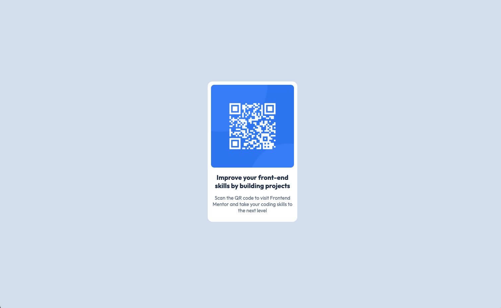

# Frontend Mentor - QR code component solution

This is a solution to the [QR code component challenge on Frontend Mentor](https://www.frontendmentor.io/challenges/qr-code-component-iux_sIO_H). Frontend Mentor challenges help you improve your coding skills by building realistic projects. 

## Table of contents

- [Overview](#overview)
  - [Screenshot](#screenshot)
  - [Links](#links)
  - [Built with](#built-with)

**Note: Delete this note and update the table of contents based on what sections you keep.**

## Overview
Creating a QR code card with HTML and CSS and a beginner coding challenge. Biggest hurdle here was learning to stage and push commits to github. God damn I still don't know what I did but it worked.

### Screenshot

### Links

- Live Site URL: https://babyjenx.github.io/qr-code-component-main/

### Built with

- HTML
- CSS
